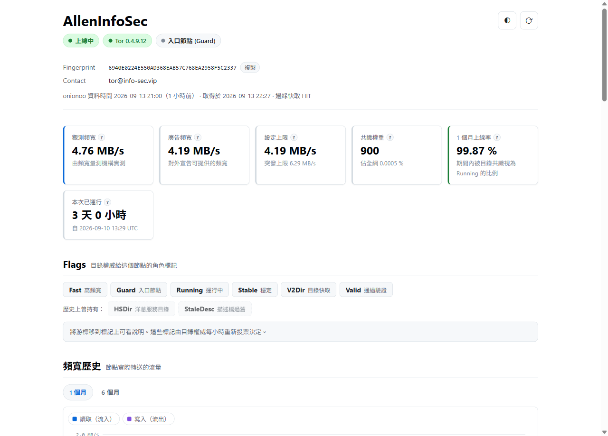
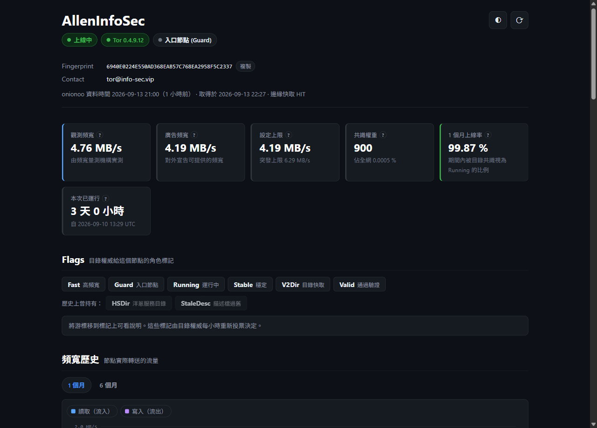

# Tor 中繼狀態頁

我自己營運的 Tor 中繼節點 **AllenInfoSec** 的運行狀態儀表板。

**→ <https://tor.info-sec.vip/>**



<details>
<summary>深色模式</summary>



</details>

## 頁面上有什麼

- **即時狀態** —— 上線與否、Tor 版本與版本推薦狀態、本次已運行多久、是否過載
- **重點數字** —— 觀測頻寬、廣告頻寬、設定上限、共識權重與佔全網比例、上線率
- **Flags** —— 目錄權威給的角色標記，每個都有中文解釋；歷史上持有過但現在沒有的也會標出來
- **頻寬歷史** —— 讀取與寫入的趨勢圖，可切換期間，游標移上去看每個時間點的數值
- **上線率** —— 時間軸色塊帶一眼看出什麼時候斷過線，以及各 flag 的持有比例
- **共識權重與路徑機率** —— 被選為入口／中間／出口節點的機率隨時間的變化
- **節點資訊** —— 位址、AS、家族、生命週期等完整欄位
- **Exit Policy** —— 直接給一句結論說明這個節點會不會把流量送出 Tor 網路

深色模式跟隨系統，也可以手動切換。手機上是另外排過的版面。

## 為什麼要自己做一個

資料本身來自 Tor Metrics 的 [onionoo API](https://onionoo.torproject.org/)，
官方的 Relay Search 也查得到。自己做的原因有兩個：

**一、有些網路連不到 torproject.org。** 如果讓瀏覽器直接去打 onionoo，
那些人看到的就是一片空白。所以這個站的資料是由 Cloudflare 邊緣代為取得的
—— 訪客的瀏覽器只連 `tor.info-sec.vip`，全程不碰 torproject.org。

**二、想看的東西集中在一頁。** 官方介面資訊密度高但分散，
這裡把我實際會關心的指標挑出來，加上中文說明。

## 做法

```
tor.info-sec.vip  (Cloudflare Workers + Static Assets)
│
├── public/      靜態檔，唯一會被公開的目錄
│
└── worker.js    /api/onionoo/* 由 Cloudflare 邊緣代為取得 onionoo 資料
                 其餘路徑送靜態檔，並補上安全標頭與 CSP
```

前端零依賴、零建置：沒有框架、沒有打包器、沒有 npm，
瀏覽器直接載入原生 ES modules。

圖表是手寫 SVG，約 300 行。不引入圖表函式庫是刻意的
—— 這個站的存在理由就是「訪客連不到外部主機」，
再掛一個 CDN 依賴等於把同一個問題搬到別的網域上。
好處是顏色可以直接吃 CSS 變數，深色模式不必另外處理。

四個 onionoo 端點併發取得，任何一個失敗只會讓該區塊顯示錯誤，
其餘照常顯示。

## 換成你自己的節點

改 `public/config.js` 一個檔案：

```js
export const RELAYS = [
  { fingerprint: "你的 fingerprint", label: "你的 nickname" },
];
```

多加幾筆就會長出節點切換頁籤。push 到 `main` 之後 Cloudflare 會自動部署。

## 授權

MIT。資料來自 [Tor Metrics](https://metrics.torproject.org/)，
依 [CC0](https://creativecommons.org/publicdomain/zero/1.0/) 釋出。
